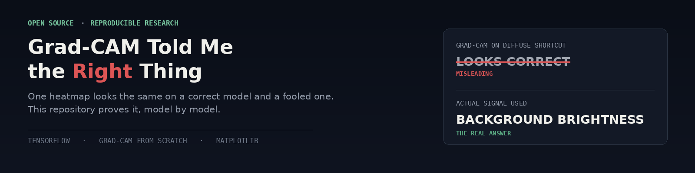

<div align="center">

# Grad-CAM Told Me My Model Was Looking at the Right Thing
**A reproducible case study in when Grad-CAM catches a model cheating, and when it produces a heatmap that looks exactly like success.**

[](#)
[](#)
[](#)
[](LICENSE)

</div>

> A heatmap that lands on a plausible-looking region feels like evidence, even when it isn't. Four trained models later, one of them is confidently wrong in a way Grad-CAM cannot see, and the picture it draws looks identical to the model that got it right.



---

## Why this exists

Grad-CAM is probably the most widely used interpretability tool for CNNs, and it shows up constantly as the thing a paper or a model card points to and says "see, the model is looking at the right region." That claim is only sometimes true, and the method gives no visible warning when it isn't.

This repository is the full, reproducible proof of both halves of that claim. A clean model, a model trained with a shortcut small enough to seem safe, a model with that same shortcut shrunk further, and a model whose shortcut has no location at all, tested honestly enough that the method's real blind spot shows up in the results rather than being explained away. Every number in the article traces back to the notebook in this repo. Nothing here is illustrative or hand-picked.

---

## The finding, in one table

| Model | Test Accuracy | Actual Signal Used | Grad-CAM Verdict |
|:--|:--:|:--|:--|
| Clean | 0.9950 | Shape | Correctly localizes shape |
| Localized shortcut, 6x6px marker | 0.9917 | Marker only | Correctly localizes marker |
| **Localized shortcut, 2x2px marker** | 0.9917 | Marker only | **Still catches it** |
| Diffuse shortcut, global brightness | 0.9483 | Brightness only | Misleadingly highlights shape |

*Every model scores between 94.8% and 99.5% accuracy. Grad-CAM correctly flags the shortcut in three of the four models, including one hidden in 2x2 pixels, and produces a misleading, clean-looking heatmap on the fourth. That gap is the entire point of this project.*

---

## Repository structure

```
gradcam-shortcut-demo/
│
├── article.md                          Full write-up: math, code, findings, checklist
├── README.md                           You are here
├── LICENSE                             MIT
├── requirements.txt                    Exact dependencies to reproduce every result
│
├── notebook/
│   └── gradcam_shortcut_demo.ipynb     End-to-end, runnable top to bottom: data → models → every figure
│
└── figures/
    ├── readme_banner.png                       This page's header image
    ├── banner.png                              Cover image used in article.md and on Medium
    ├── fig1_dataset_samples.png                Synthetic circle vs square samples, shortcut variant
    ├── fig2_gradcam_clean.png                  Grad-CAM overlays, clean model
    ├── fig3_gradcam_shortcut.png               Grad-CAM overlays, localized shortcut model
    ├── fig4_accuracy_comparison.png            Test accuracy, all four models
    ├── fig5_probe_reliance.png                 Decoupled probe set, shortcut model
    ├── fig6_gradcam_tiny_marker.png             Grad-CAM overlays, 2x2px marker
    ├── fig7_gradcam_diffuse.png                Grad-CAM overlays, diffuse shortcut model
    ├── table_results_summary.png               Results table, styled for visual publishing
    └── equations/
        ├── eq_channel_weights.png
        └── eq_gradcam_map.png
```

---

## What's inside the dataset

A fully synthetic, procedurally generated stand-in for a real image classification problem, built so the ground truth discriminative signal is always known exactly:

| Property | Value |
|:--|:--|
| Task | Binary classification, circle vs square |
| Image size | 64x64, single channel |
| Shape signal | Randomized position, size, rotation, deliberately low contrast and noisy |
| Localized shortcut | A bright corner marker, 6x6px or 2x2px, correlated with the label at 99.5% |
| Diffuse shortcut | A global background brightness shift, correlated with the label at 95% |
| Seeds | Fixed per model (1 through 4), for exact reproducibility |

---

## The four models, tested honestly

| Model | What it tests | What actually happened |
|:--|:--|:--|
| **Clean** | Baseline, nothing to cheat with | Grad-CAM correctly localizes the shape, every time |
| **Localized shortcut (6x6px)** | A shortcut easy to see if you're looking for it | Grad-CAM correctly ignores the shape and flags the marker |
| **Localized shortcut (2x2px)** | Whether shrinking the shortcut lets it escape Grad-CAM's resolution | It did not. Grad-CAM still isolates a 2x2 pixel patch |
| **Diffuse shortcut (brightness)** | A shortcut with no single region to point to | Grad-CAM produces a clean heatmap on the shape, and is completely wrong |

No result here is presented as a universal property of Grad-CAM. The point of showing all four, with the full Grad-CAM overlays and probe-set results behind them, is that a clean-looking heatmap is not proof of correct reasoning. It has to be checked against a shortcut hypothesis that includes diffuse, non-spatial failure modes, not assumed safe because the picture looks reasonable.

---

## Reproduce it

```bash
git clone https://github.com/zain-ul-abideen-5036/gradcam-shortcut-demo.git
cd gradcam-shortcut-demo

python -m venv venv
source venv/bin/activate        # Windows: venv\Scripts\Activate.ps1

pip install -r requirements.txt

jupyter notebook notebook/gradcam_shortcut_demo.ipynb
```

Run the notebook top to bottom. Every figure in `figures/` regenerates from scratch, and the printed summary table will match the one above, since every random process in the pipeline is seeded.

Want to test this on a different shortcut instead of a brightness shift? Replace the `make_diffuse_dataset(...)` cell with your own transformation. Everything downstream, training, the probe set, every figure, adapts automatically.

---

## Read the full write-up

The complete article, including the math behind Grad-CAM, the full walkthrough of all four models, and the checklist for auditing any heatmap you're handed, lives in [`article.md`](article.md) in this repo, and is also published on Medium.

**[Read "Grad-CAM Told Me My Model Was Looking at the Right Thing" on Medium →](#)**

---

## Why this matters beyond this one dataset

This case study is a direct extension of interpretability questions that show up constantly in real diagnostic imaging work: Grad-CAM (or a similar class activation method) used as the sanity check on whether a CT or MRI classifier is actually looking at the relevant anatomy, when the real confound (a scanner-specific artifact, an exposure difference between sites, a compression signature) is exactly the kind of diffuse, non-localized shortcut this repository shows the method cannot see. The habit this repo argues for, a decoupled probe set before a trusted heatmap, is the same discipline behind catching subject-level data leakage and validation-pipeline leaks before they inflate a reported result anywhere else.

---

## License

Released under the [MIT License](LICENSE). Use the code freely. If you reference the article or its findings, an attribution back to this repository or the Medium piece is appreciated.

---

<div align="center">

## About the Author


### Zain Ul Abideen

</div>

I work at the intersection of applied machine learning and computer vision, mostly living in the space between a model that runs and a model that can be trusted. That usually means chasing down the quiet failure modes that a headline metric hides: data leakage, mismatched validation splits, and, as this repository shows, accuracy scores that look great and mean nothing.

I graduated in Computer Science from the University of Central Punjab, Lahore, with a minor in AI, ML, and Deep Learning, and I currently work as a Lead AI/ML Instructor while holding a Senior Microsoft Learn Student Ambassador (Gold) role. Alongside that, I take on applied ML engineering work for external clients and collaborate on graduate-level research, most recently redesigning the validation methodology and statistical testing for an MSc dissertation on deep transfer learning.

This repository is part of a broader, ongoing body of public research work: reproducible case studies, each one built to be run, questioned, and verified rather than taken on faith. Every piece follows the same rule this one does: if the honest result is a fix that underperforms or a number that doesn't move the way it's supposed to, that stays in, because that's usually the more useful finding.

<br/>

<div align="center">

[](https://github.com/zain-ul-abideen-5036)
[](https://linkedin.com/in/zain-ul-abideen3)

<br/>

*If this repository helped you catch a heatmap you were about to trust too much, a star is the best kind of feedback.*

</div>
