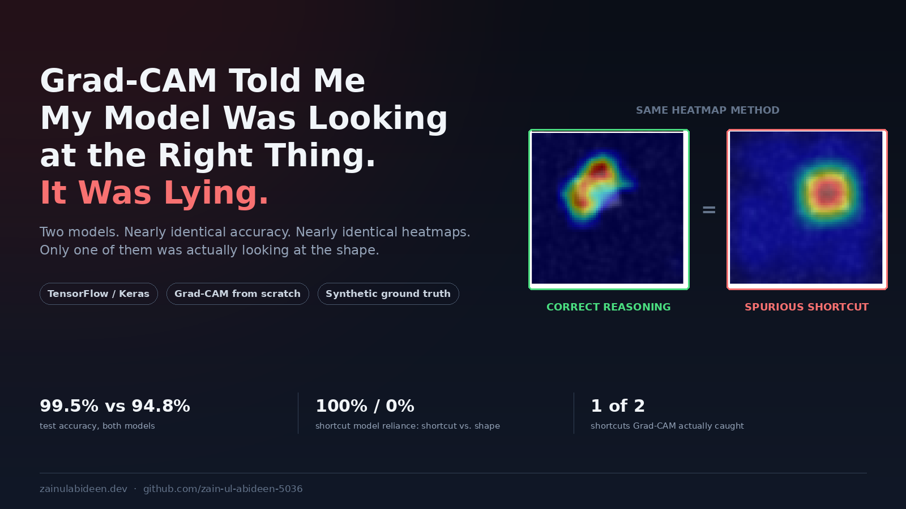
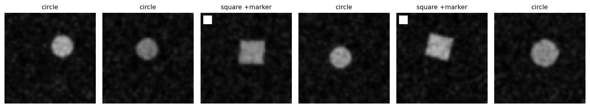
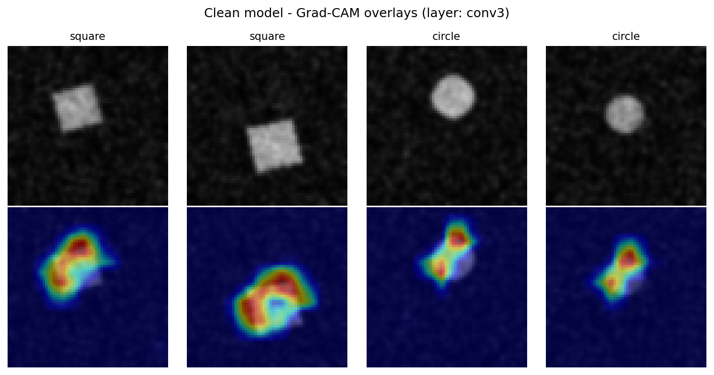
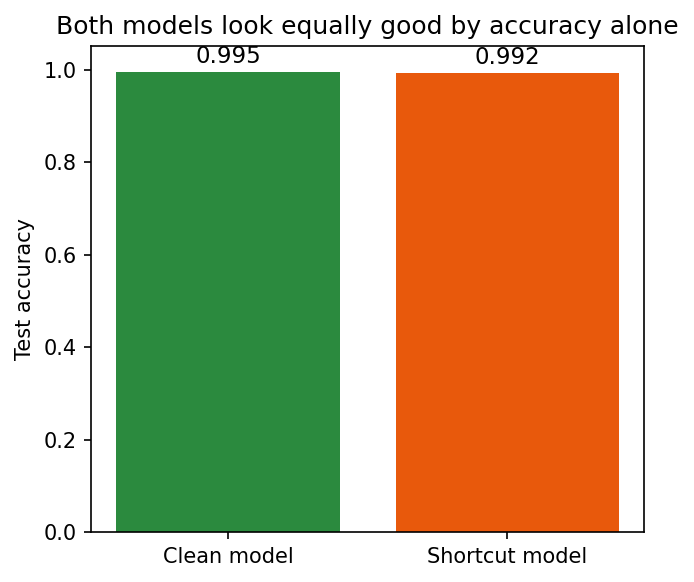
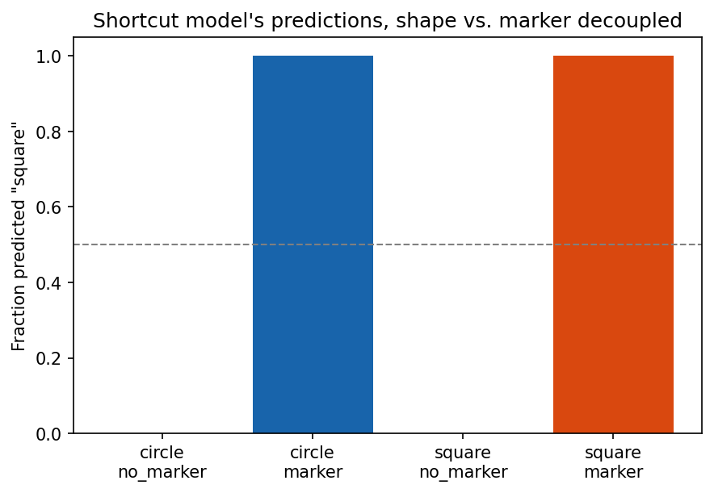
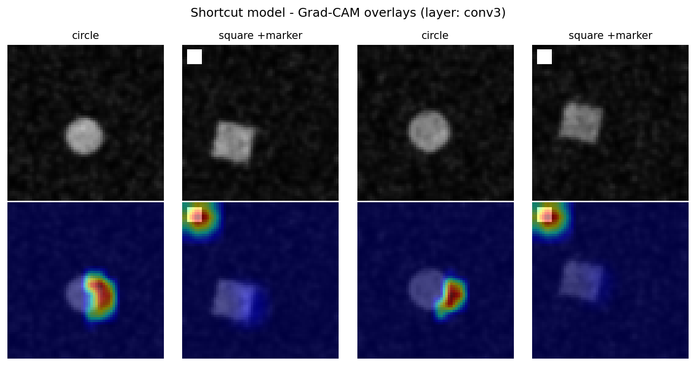
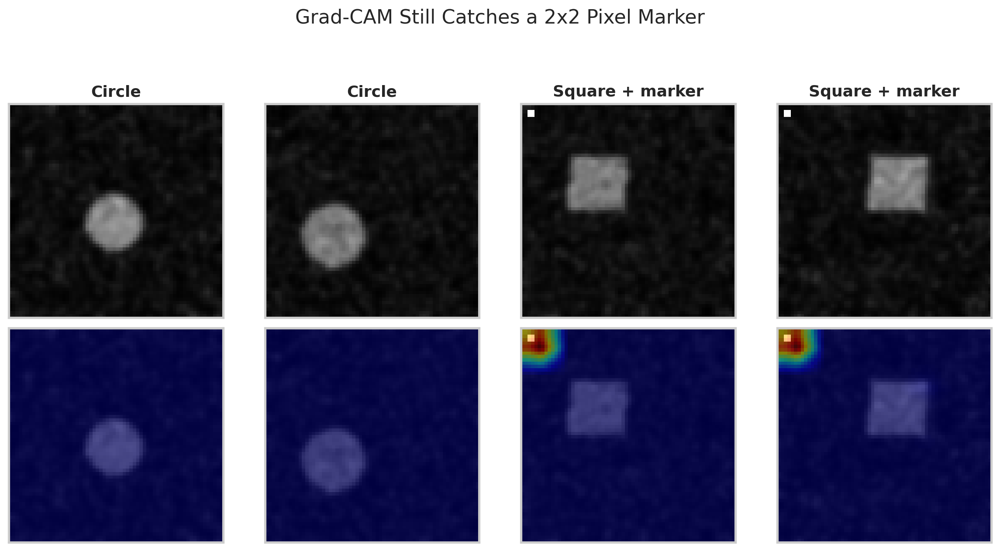
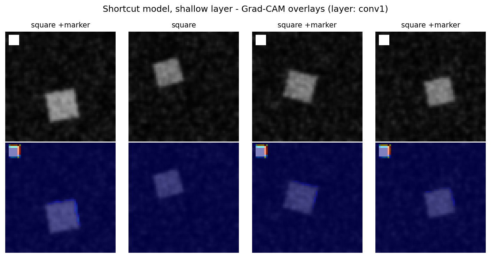
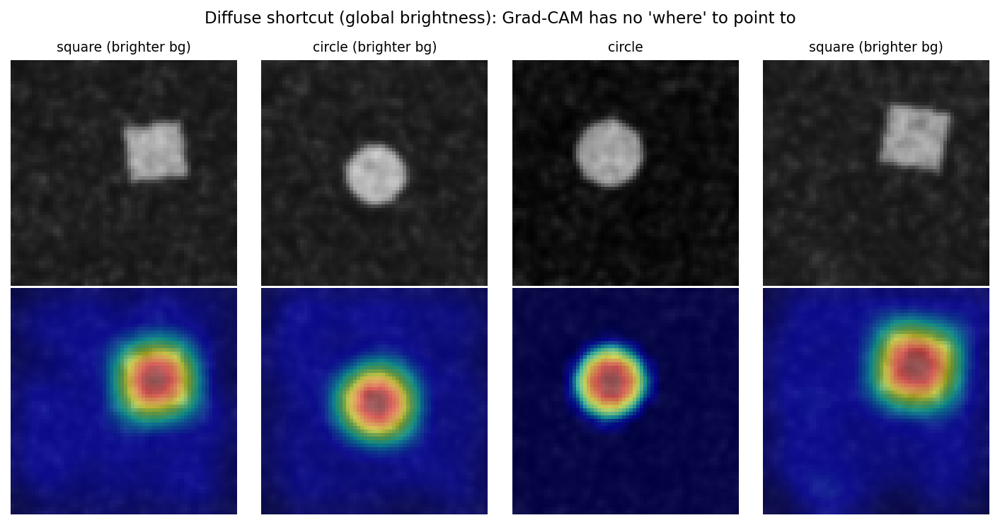

# Grad-CAM Told Me My Model Was Looking at the Right Thing. It Was Lying.

*Why saliency maps can look confident and well-localized while pointing at nothing real.*



---

I trained a small CNN to tell circles from squares. It hit 94.8% test accuracy. I ran Grad-CAM on it, and the heatmap did exactly what a Grad-CAM heatmap is supposed to do: it lit up in a tight, confident circle right on top of the shape in the image.

The model wasn't looking at the shape at all. It was reading the average brightness of the background, a cue that isn't localized anywhere, that Grad-CAM structurally cannot see, and that produced a heatmap indistinguishable from a model that was actually doing its job.

That's the finding this article is built around. Not a hypothetical: three trained models, one shared architecture, and heatmaps you can look at yourself.

## The setup

Grad-CAM (Gradient-weighted Class Activation Mapping) is probably the most widely used interpretability tool for CNNs. Point it at a trained model and an input image, and it draws you a heatmap over the regions that most influenced the prediction. It shows up in medical imaging papers, in "trust but verify" sections of model cards, in countless "here's why my model works" blog posts. It's popular because it's cheap (one backward pass, no retraining, no extra annotations) and because the output is a picture, and pictures are persuasive.

That last part is the problem. A heatmap that lands on a plausible-looking region *feels* like evidence, even when it isn't.

To test where the method actually breaks, I built a task where I control the ground truth completely: classify small synthetic images as a circle or a square. Because I'm generating the data, I know exactly what a model *should* be looking at, which means I can also tell, unambiguously, when a heatmap is lying to me.

## What Grad-CAM actually computes

Skipping the equations: Grad-CAM runs an image through the network and looks at the activations of a chosen convolutional layer, a stack of feature maps, each one a detector for some pattern the network learned. Then it asks a simple question of each feature map: *if this map's activations went up a little, how much would the predicted class score go up?* That's just the gradient of the output with respect to the feature map, averaged over space to get one importance weight per channel.

Weight each feature map by that importance, sum them, and clip anything negative. You only want evidence *for* the class, not against it. Upsample the result back to image size and overlay it. That's the whole method.

The key limitation is baked into step one: everything happens at the resolution of the chosen convolutional layer. In the network I used here, the last conv layer sees a 16×16 grid for a 64×64 input. Whatever Grad-CAM tells you, it's telling you at that resolution, then blurring it back up to look precise.

## Experiment 1: the clean case

First, a model with nothing to cheat with. Circles and squares, randomized position, size, and rotation, on a noisy background. The noise is there on purpose, so the task isn't trivially easy and the model has to actually learn shape.

<p align="center"></p>

This model hit 99.5% test accuracy, and Grad-CAM at the final conv layer shows exactly what you'd hope: a tight, well-localized heatmap sitting right on top of the shape, for both classes.

<p align="center"></p>

Good. The method works when the model is doing the right thing. That's the baseline every other result gets compared against.

## Experiment 2: a shortcut you can see

Next, I injected a spurious feature: a small bright marker in the top-left corner, present on 99.5% of squares and essentially never on circles during training. A model doesn't need to learn "square" when a 6×6-pixel white patch predicts the label almost perfectly and is trivially easy to detect.

To make this a fair fight rather than a foregone conclusion, I also made the shape signal itself noisier and lower-contrast than in the clean run: smaller shapes, heavier background noise, mild blur. The point isn't "give the model an obviously easier shortcut," it's "give it a shortcut that's genuinely competitive with the intended signal," which is closer to how shortcuts actually arise in real datasets.

The shortcut model reached 99.2% test accuracy, statistically indistinguishable from the clean model. By the numbers, these are two equally good classifiers.

<p align="center"></p>

They are not equally good. To find out what the shortcut model was *actually* using, I built a probe set that decouples shape from marker completely: circles with and without the marker, squares with and without the marker, in equal numbers, combinations the model never saw during training in that proportion.

<p align="center"></p>

The result is about as stark as it gets. The model's prediction is 100% determined by marker presence and 0% by actual shape. Show it a circle with the marker, it says "square." Show it a square with no marker, it says "circle." Shape is completely irrelevant to this model's decision. Accuracy just never caught it, because in the training distribution, shape and marker agreed almost all the time.

So does Grad-CAM catch this? Here, yes:

<p align="center"></p>

For every square with a marker, the heatmap ignores the shape entirely and lights up the corner. This is Grad-CAM working exactly as intended, correctly implicating the shortcut. I want to be upfront about that, because it complicates the tidier version of the story I expected going in.

## Trying to break it: shrinking the shortcut

My working hypothesis was that a small enough shortcut would fall below the resolution of the final conv layer (16×16 cells for a 64×64 image, each cell covering roughly a 4×4 pixel patch before accounting for the receptive field) and vanish from the heatmap even though the model kept relying on it. I shrank the marker to 2×2 pixels and retrained.

The model's reliance was identical: 100% marker, 0% shape, on the decoupled probe set. But Grad-CAM still found it.

<p align="center"></p>

Even at 2×2 pixels, the marker is stark white against a noisy dark background, a huge, unambiguous local gradient, and that's enough for Grad-CAM to isolate it, regardless of how few pixels it physically occupies. My "resolution hides small shortcuts" hypothesis, at least in this simple setting, didn't hold up. I'd rather report that than quietly drop it.

I also ran the shortcut model's Grad-CAM at a shallower layer (`conv1`, before any pooling, so the highest spatial resolution the network has):

<p align="center"></p>

At this layer the heatmap is noisier and less clearly diagnostic. It traces edges and low-level texture rather than cleanly isolating the marker. Depth matters, but not in the direction I'd first assumed: the deeper, coarser layer was the more reliable one here, not the less reliable one.

## Experiment 3: a shortcut with no "where"

If a compact, high-contrast shortcut isn't hard enough for Grad-CAM, what actually breaks it? The method is fundamentally spatial. It can only ever answer "which region mattered." So I built a shortcut with no region to point to at all: instead of a corner marker, I shifted the *entire background's* brightness by a small, visually subtle amount, correlated with the label the same way the marker was.

This model reached 94.8% test accuracy, and the probe test showed the same story as before: 100% reliance on the brightness shift, 0% on actual shape.

```
circle,  no shift            -> predicted square: 0%
circle,  brightness shift    -> predicted square: 100%
square,  no shift            -> predicted square: 0%
square,  brightness shift    -> predicted square: 100%
```

Now the heatmap:

<p align="center"></p>

This is the result that opened this article. The heatmap is tight, confident, and sitting right on the shape, visually almost identical to the clean model's correct localization. There is nothing in this picture that would tell you the model is actually reading a global brightness statistic that happens to be smeared across the entire image. The heatmap isn't ambiguous or noisy in a way that might tip you off. It's clean, and it's wrong.

My best read on why: the shape region is simply where the network's activations are largest in magnitude. Edges and local contrast produce strong feature-map responses almost regardless of *why* the network is confident. Grad-CAM shows you where activation is high, not why the model made its choice, and those two things came apart completely here.

## The honest takeaway

Three models, all in the 95% to 99.5% accuracy range, only one of them actually using the shape. Grad-CAM correctly flagged the shortcut when that shortcut was a compact, high-contrast, spatially localized region, even a tiny one. It gave no warning at all when the shortcut was diffuse.

That's a more specific and more useful claim than "Grad-CAM can't be trusted." It can be trusted for one narrow thing: telling you which *region* of the input mattered most to a prediction, when the answer to "why" happens to live in a region at all. It cannot tell you about global statistics, texture, color balance, frequency-domain artifacts, or anything else that isn't spatially localized, and it will not show you an empty heatmap or a warning sign when that's the case. It will show you something that looks exactly like success.

Practically:

- A clean, well-localized Grad-CAM heatmap is evidence the model *might* be reasoning correctly. It is not proof.
- Treat Grad-CAM as a hypothesis generator, not a verification tool. If it shows something suspicious, that's real signal. If it shows something reassuring, that's weaker signal than it looks.
- Pair it with intervention-based tests where you can: build a decoupled probe set, corrupt or remove a suspected shortcut, and see if the prediction changes. That test caught both shortcut models here immediately and unambiguously; accuracy and Grad-CAM together did not.
- Be specifically skeptical of "the heatmap looks right" as a stopping point on tasks where diffuse confounds are plausible, such as scanner-specific imaging artifacts, lighting or exposure differences between data-collection sites, or compression artifacts that differ across sources. These are exactly the class of shortcut this experiment shows Grad-CAM cannot see.

## A checklist for stress-testing your own model's explanations

1. **Don't stop at accuracy.** Two models can match on accuracy while disagreeing completely on what they're using, as shown directly above.
2. **Build a decoupled probe set.** Identify any feature suspected of correlating with the label and construct examples where it's present without the true signal, and vice versa. This is usually more informative than any saliency method.
3. **Vary the shortcut's spatial footprint before concluding Grad-CAM would catch it.** Don't assume small or subtle shortcuts are safe from detection, or that Grad-CAM would flag every shortcut that *is* detectable. Check both localized and diffuse cases explicitly.
4. **Check more than one layer.** A heatmap's reliability isn't constant across depth. In this experiment, the deeper, coarser layer was actually the more trustworthy one, which runs against the usual intuition that finer resolution is always better.
5. **Ask whether the failure mode you're worried about could even be spatial.** If it's a scanner artifact, exposure difference, JPEG compression signature, or anything else that isn't confined to a region, a class activation map is structurally the wrong tool, no matter how carefully you apply it.

---

*This is the second article in a series on interrogating the assumptions built into common ML evaluation and interpretability practices. The first covered [subject-level data leakage in human activity recognition](#). Code, trained-model probe results, and all figures for this experiment are available in the accompanying [GitHub repository](#).*
