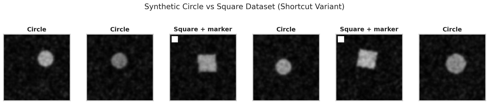
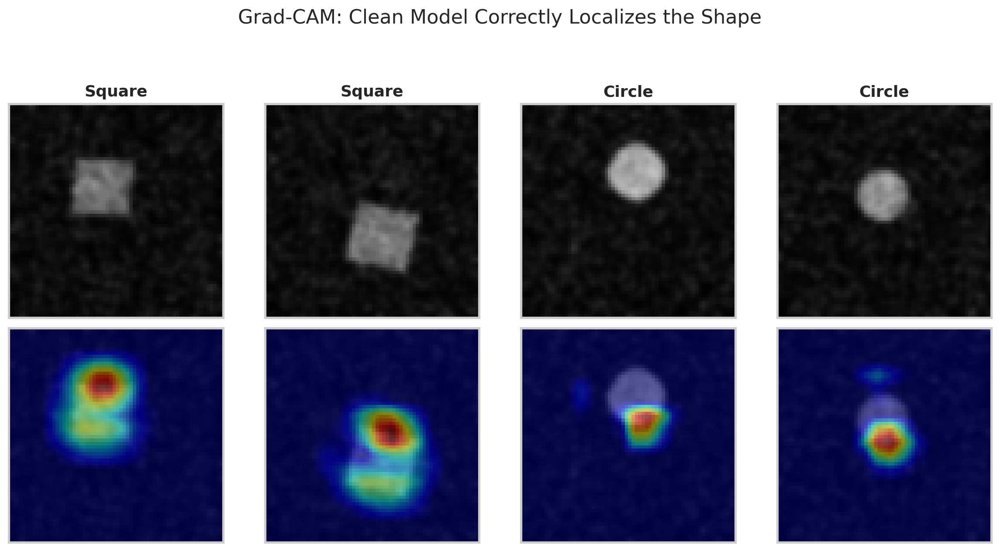
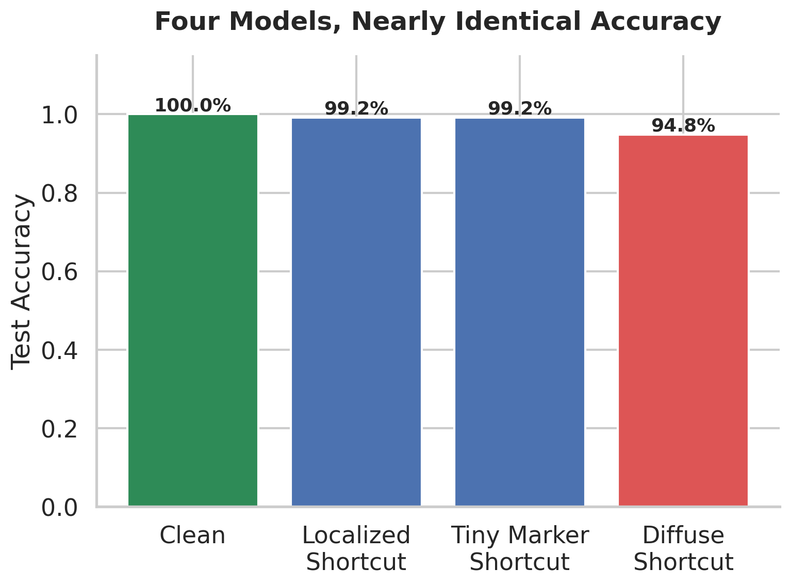
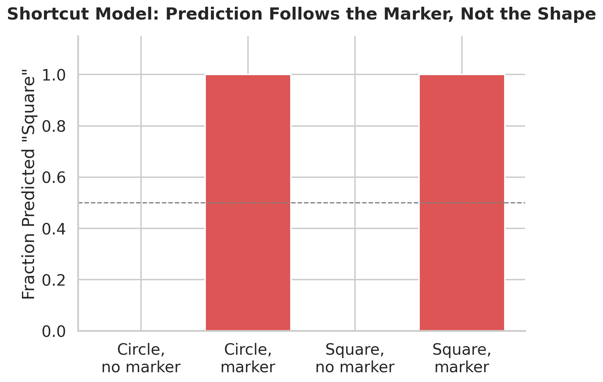
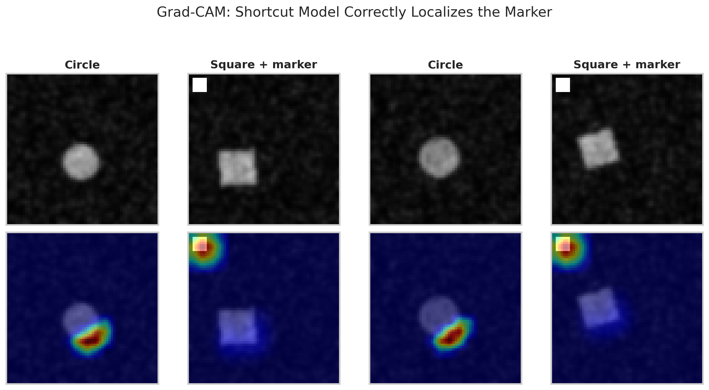
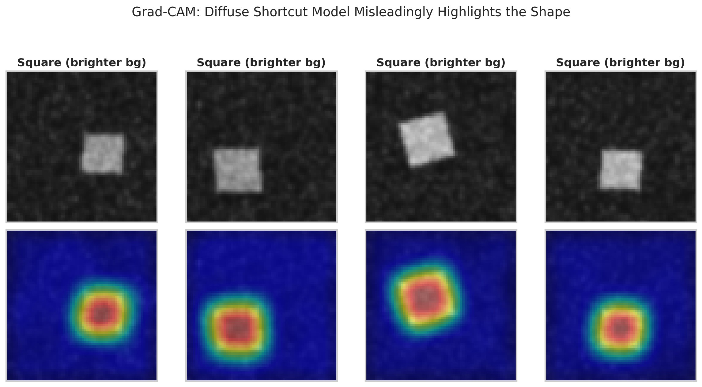

# Grad-CAM Told Me My Model Was Looking at the Right Thing. It Was Lying.

### It was lying, but only about one specific kind of shortcut. This is a full, reproducible teardown of when Grad-CAM catches a model cheating and when it produces a heatmap indistinguishable from a model reasoning correctly, using four trained models and the code behind every one of them.


*Originally published on [Medium](https://medium.com/@zainulabideen5/grad-cam-told-me-my-model-was-looking-at-the-right-thing-it-was-lying-adea677fb59c). This version is the full technical companion, with every figure and result reproducible from the notebook in this repository.*

---

I trained a small CNN to tell circles from squares. It hit 94.8% test accuracy. I ran Grad-CAM on it, and the heatmap did exactly what a Grad-CAM heatmap is supposed to do: it lit up in a tight, confident circle right on top of the shape in the image.

The model was not looking at the shape at all. It was reading the average brightness of the background, a cue that is not localized anywhere, that Grad-CAM structurally cannot see, and that produced a heatmap indistinguishable from a model that was actually doing its job.

This is one of the most under-discussed failure modes in applied deep learning: the interpretability tool you use to check whether a model learned the right thing can look completely convincing while being completely wrong, and it will not warn you when that happens. This piece works through exactly when Grad-CAM catches this and when it does not, using four trained models and heatmaps you can look at yourself. It is a natural extension of the interpretability work that shows up constantly in medical imaging classification, where Grad-CAM is the standard sanity check on whether a model is looking at the right region of a scan.

All code, figures, and the dataset generator are in this repository's [`notebook/`](notebook/gradcam_shortcut_demo.ipynb) folder. Nothing here depends on a hidden dataset or a cherry-picked run.

---

## What Grad-CAM actually computes

Grad-CAM (Gradient-weighted Class Activation Mapping) runs an image through a trained network and looks at the activations of a chosen convolutional layer, a stack of feature maps, each one a detector for some pattern the network learned. It then asks a simple question of each feature map: if this map's activations went up a little, how much would the predicted class score go up? That is the gradient of the class score with respect to the feature map, averaged over space to get one importance weight per channel.

$$
\alpha_k = \frac{1}{Z} \sum_{i} \sum_{j} \frac{\partial y^c}{\partial A^k_{ij}}
$$

Weight each feature map by its importance, sum them, and clip anything negative with a ReLU, since only evidence for the class is kept, not against it:

$$
L^c_{\mathrm{Grad\text{-}CAM}} = \mathrm{ReLU}\!\left( \sum_k \alpha_k A^k \right)
$$

Upsample the result back to image size and overlay it. That is the whole method, and the limitation is baked into the first equation: everything happens at the resolution of the chosen convolutional layer. In the network used here, the last conv layer sees a 16x16 grid for a 64x64 input. Whatever Grad-CAM tells you, it is telling you at that resolution, then blurring it back up to look precise.

To test where the method actually breaks, I built a task where the ground truth is fully known: classify small synthetic images as a circle or a square.

```python
def make_dataset(n_per_class, seed, inject_marker, marker_box=None):
    rng = np.random.default_rng(seed)
    images, labels, markers = [], [], []
    for label in (0, 1):
        for _ in range(n_per_class):
            img, has_marker = _make_image(label, rng, inject_marker, marker_box=marker_box)
            images.append(img); labels.append(label); markers.append(has_marker)
    images = np.array(images, dtype=np.float32)[..., None]
    labels = np.array(labels, dtype=np.int32)
    markers = np.array(markers, dtype=bool)
    idx = rng.permutation(len(images))
    return images[idx], labels[idx], markers[idx]
```

Because I am generating the data myself, I know exactly what a model should be looking at, which means I can also tell, unambiguously, when a heatmap is lying to me.

---

## Building the case: a clean model, then a shortcut you can see

First, a model with nothing to cheat with. Circles and squares, randomized position, size, and rotation, on a noisy background, so the model has to actually learn shape.

<p align="center">
  
</p>

<p align="center">
  <strong>Figure 1.</strong> Six samples from the shortcut variant of the dataset. Two square samples contain an injected marker in the top-left corner, while every circle and unmarked square remains otherwise identical in style and noise level. This controlled setup allows the experiment to test whether the model learns the actual shape or relies on the artificial shortcut.
</p>

This model reached 99.5% test accuracy, and Grad-CAM at the final conv layer shows exactly what you would hope.

<p align="center">
  
</p>

<p align="center">
  <strong>Figure 2.</strong> Grad-CAM overlays for the clean model, computed at the final convolutional layer. The heatmaps consistently focus on the shape itself across all four examples, indicating that the model's predictions are based on the relevant visual structure rather than an artificial shortcut.
</p>

Next, I injected a spurious feature into a second model: a small bright marker in the top-left corner, present on 99.5% of squares and essentially never on circles during training.

```python
if has_marker:
    x0, y0, x1, y1 = marker_box if marker_box is not None else MARKER_CORNER
    arr[y0:y1, x0:x1] = 255.0
```

To make this a fair fight rather than a foregone conclusion, I also made the shape signal itself noisier and lower contrast than in the clean run: smaller shapes, heavier background noise, mild blur. The shortcut model reached 99.2% test accuracy, statistically indistinguishable from the clean model.

<p align="center">
  
</p>

<p align="center">
  <strong>Figure 3.</strong> Test accuracy comparison across all four models. Although the models achieve high accuracy between 94.8% and 99.5%, the narrow performance range makes accuracy alone insufficient for determining whether the models have learned the correct underlying visual relationship.
</p>

By accuracy alone, these look like similarly capable classifiers. To find out what the shortcut model was actually using, I built a probe set that decouples shape from marker completely: circles with and without the marker, squares with and without the marker, in equal numbers, combinations the model never saw during training in that proportion.

<p align="center">
  
</p>

<p align="center">
  <strong>Figure 4.</strong> Predictions from the shortcut model on a decoupled probe set in which marker presence and actual shape are varied independently. The model's predictions follow the injected marker in 100% of cases and the actual shape in 0%, providing direct evidence that the model has learned the shortcut rather than the intended classification signal.
</p>

Prediction is 100% determined by marker presence and 0% by actual shape. Accuracy on the original test set never caught this, because in the training distribution, shape and marker agreed almost all of the time. Grad-CAM, however, does catch it.

<p align="center">
  
</p>

<p align="center">
  <strong>Figure 5.</strong> Grad-CAM overlays for the localized shortcut model. On every marked square, the heatmap ignores the shape and isolates the corner marker instead, clearly revealing that the model relies on the injected shortcut rather than the intended visual feature.
</p>


For every square with a marker, the heatmap ignores the shape entirely and lights up the corner. This is Grad-CAM working exactly as intended, correctly implicating the shortcut. I want to be upfront about that, because it complicates the tidier version of this story I expected going in.

---

## Trying to break it: shrinking the marker

My working hypothesis was that a small enough shortcut would fall below the resolution of the final conv layer, 16x16 cells for a 64x64 image, and vanish from the heatmap even though the model kept relying on it. I shrank the marker to 2x2 pixels and retrained.

```python
TINY_MARKER_BOX = (2, 2, 4, 4)  # 2x2 px, vs. the original 6x6 px
```

The model's reliance was identical: 100% marker, 0% shape. Test accuracy also barely moved, 99.2%, same as the 6x6 pixel version. But Grad-CAM still found it.


Even at this size the marker is stark white against a noisy dark background, a large, unambiguous local gradient, and that is enough for Grad-CAM to isolate it regardless of how few pixels it physically occupies. My resolution hypothesis did not hold up in this setting. I would rather report that than quietly drop it.

---

## The shortcut with no address

If a compact, high-contrast shortcut is not hard enough for Grad-CAM, what actually breaks it? The method is fundamentally spatial. It can only ever answer which region mattered. So I built a shortcut with no region to point to at all: instead of a corner marker, I shifted the entire background's brightness by a small, visually subtle amount, correlated with the label the same way the marker was.

```python
BRIGHTNESS_SHIFT = 18.0   # subtle, roughly 7% of the 0-255 range
CORRELATION = 0.95

if has_shift:
    arr = np.clip(arr + BRIGHTNESS_SHIFT, 0, 255)
```

This model reached 94.8% test accuracy, and the probe test showed the same story as before: 100% reliance on the brightness shift, 0% on actual shape.



This is the result that opened this article. The heatmap is tight, confident, and sitting right on the shape, visually almost identical to the clean model's correct localization. There is nothing in this picture that would tell you the model is actually reading a global brightness statistic smeared across the entire image. It is clean, and it is wrong.

My best read on why: the shape region is simply where the network's activations are largest in magnitude. Edges and local contrast produce strong feature map responses almost regardless of why the network is confident. Grad-CAM shows you where activation is high, not why the model made its choice, and those two things came apart completely here.

---

## Results across all four models

| Model | Test Accuracy | Actual Signal Used | Grad-CAM Verdict |
|:--|:--:|:--|:--|
| Clean | 0.9950 | Shape | Correctly localizes shape |
| Localized shortcut, 6x6px marker | 0.9917 | Marker only | Correctly localizes marker |
| **Localized shortcut, 2x2px marker** | 0.9917 | Marker only | **Still catches it** |
| Diffuse shortcut, global brightness | 0.9483 | Brightness only | Misleadingly highlights shape |

Notice the accuracy column: every model scores between 94.8% and 99.5%. **Accuracy tells you nothing about which of these models you can trust**, and neither, it turns out, does a clean-looking Grad-CAM heatmap on its own, unless you already know the shortcut you are worried about happens to live in a region.

---

## A checklist so a clean heatmap does not fool you

1. **Is the model's accuracy being taken as confirmation that a clean Grad-CAM heatmap means correct reasoning?** As shown above, accuracy does not distinguish these four models at all.
2. **Has a decoupled probe set been built?** Checking what the model does when a suspected shortcut is present without the true signal, and vice versa, catches every shortcut in this article, including the one Grad-CAM missed entirely.
3. **Could the failure mode be diffuse rather than localized?** A global statistic, a texture, a color balance, a compression artifact, none of these live in a region, and none of them would produce a heatmap any different from a correctly reasoning model.
4. **Has Grad-CAM been checked at more than one layer?** Reliability is not constant across depth. In this experiment the deeper, coarser layer was the more trustworthy one, not the less trustworthy one.
5. **Would the heatmap still look clean if the real driver of the prediction were something Grad-CAM structurally cannot represent?** If the answer is yes, the heatmap was never evidence in the first place.

None of this makes Grad-CAM useless. It correctly caught a shortcut hidden in a 6x6 pixel corner, and it still caught one hidden in 2x2 pixels. It just answers a narrower question than the picture makes it feel like it does: which region mattered, not why the model is confident. Treat it as a hypothesis generator, not a verification tool, and pair it with an intervention-based test, a decoupled probe set, a corrupted or removed suspected shortcut, whenever the stakes justify it.

---

## Reproduce every result in this article

```bash
git clone https://github.com/zain-ul-abideen-5036/gradcam-shortcut-demo.git
cd gradcam-shortcut-demo
pip install -r requirements.txt
jupyter notebook notebook/gradcam_shortcut_demo.ipynb
```

Run top to bottom. Every figure above regenerates from scratch, and the printed summary table will match the one in this article, since every random process in the pipeline is seeded. Full details in [`README.md`](README.md).

*Full reproducible code, all figures, and the dataset generator are available in this repository. Clone it, change the seed, and check whether the finding holds. It does, because it is structural, not incidental to one run.*
